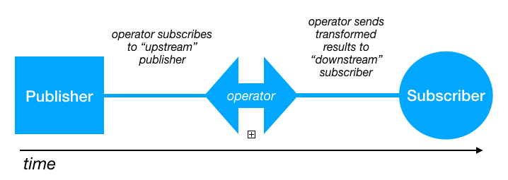

# SwiftUI-Combine-NotificationDemo
## Using SwiftUI and Combine extensions to NotificationCenter
**(Updated for Xcode 11 Beta 6)**

In this SwiftUI and Combine demo I create a simple iOS app that demonstrates how to use Combine extensions to NotificationCenter with SwiftUI.

___

## Introduction
Apple’s new **Combine**, introduced at WWDC 2019, is a **declarative**, **functional**, **reactive** framework designed to make it easier 
to work with "processing values over time". 
This means it aids the developer when working with timers, notifications, asynchronous data requests over the web, etc. 

We’ll see how Combine really can simplify asynchronous code like networking, key value observing, notifications and callbacks.
Note, however, that Combine is not meant to replace existing technologies, but to provide an augmentation (extension) that fits with modern 
declarative frameworks like SwiftUI.

In this demo we’ll see how **Combine** provides an extension to the existing **Notification Center** that makes it easy to subscribe 
to published notifications.

___

## Combine: Design and Concepts
Combine's design is based around three fundamental concepts:

* **Publishers** - publish values to subscribers
* **Operators** - transform published values 
* **Subscribers** - subscribe to publishers



___

## Demo design

* Our simple demo has two views: **ContentView** and **View2**
* ContentView has an instance of the data model (see below) and shows a list of notifications received from View2
* View2 has a button that can be tapped to publish a message via Notification Center
* The data model subscribes to notifications emitted by NotificationCenter and stores them
* We use an operator to transform the notification into a simple string which we can display in a list:

``` swift
// Subscribe to "View2Msg" messages broadcast by NotificationCenter
notificationSub = NotificationCenter.default.publisher(for: View2.notificationName)
    .map { notification in notification.object as? String }   // map operator transforms the notification into a string
    .assign(to: \ContentViewModel.newNotification, on: self)  // assign the msg to a property using a keypath 
```

Here’s the full code for our data model: 

``` swift
//
//  ContentViewModel.swift
//  SwiftUI-Combine-NotificationDemo
//
//  Created by Russell Archer on 30/07/2019.
//  Copyright © 2019 Russell Archer. All rights reserved.
//

import Foundation
import Combine

class ContentViewModel: ObservableObject {
    var notificationSub: AnyCancellable?
    var notifications = [String]()  // Holds a list of notifications received from View2 via NotificationCenter
    
    // By publishing this property we can ensure that our subscriber (ContentView) will be
    // re-rendered when the property changes (i.e. whenever there's a new notification)
    @Published var newNotification: String? {
        didSet {
            guard newNotification != nil else { return }
            
            notifications.append(newNotification!)
        }
    }
    
    init() {
        // Subscribe to "View2Msg" messages broadcast by NotificationCenter
        notificationSub = NotificationCenter.default.publisher(for: View2.notificationName)
            .map { notification in notification.object as? String }   // map operator transforms the notification into a string
            .assign(to: \ContentViewModel.newNotification, on: self)  // assign the msg to a property using a keypath
    }
}
```

Note that the data model conforms to the **ObservableObject** protocol. 
This enables our SwiftUI **ContentView** to subscribe to changes in the model by declaring it to be an **@ObservedObject**:

``` swift
@ObservedObject var model = ContentViewModel()  // Subscribe to changes to our model (i.e. new notifications)
```

As you can see, whenever a new notification is received it’s assigned to the data model’s **newNotification** property. 
By making this a **@Published** property we can propagate changes to ContentView so that its body property is re-evaluated, 
causing the view to be re-rendered.

``` swift
//
//  ContentView.swift
//  SwiftUI-Combine-NotificationDemo
//
//  Created by Russell Archer on 29/07/2019.
//  Copyright © 2019 Russell Archer. All rights reserved.
//
// Tested and working with Xcode 11 Beta 6 on Mojave 10.14.6
//

import SwiftUI
import Combine

struct ContentView: View {
    @ObservedObject var model = ContentViewModel()  // Subscribe to changes to our model (i.e. new notifications)
    
    var body: some View {
        NavigationView {
            VStack {
                NavigationLink(destination: View2()) {
                    Text("Goto View2")
                }
  
                List(model.notifications) { notification in
                    Text(notification)
                }
            }
            .navigationBarTitle(Text("Notification Center Demo"), displayMode: .inline)
        }
    }
}

#if DEBUG
struct ContentView_Previews: PreviewProvider {
    static var previews: some View {
        ContentView()
    }
}
#endif

//
//  View2.swift
//  SwiftUI-Combine-NotificationDemo
//
//  Created by Russell Archer on 29/07/2019.
//  Copyright © 2019 Russell Archer. All rights reserved.
//

import SwiftUI
import Combine

struct View2: View {
    public static let notificationName = Notification.Name("View2Msg")
    var body: some View {
        VStack {
            Text("View2").font(.headline)
            Button("Send Message to ContentView") {
                NotificationCenter.default.post(name: View2.notificationName, object: "Hello from View2 at \(Date())")
            }
        }
    }
}

#if DEBUG
struct View2_Previews: PreviewProvider {
    static var previews: some View {
        View2()
    }
}
#endif
```

